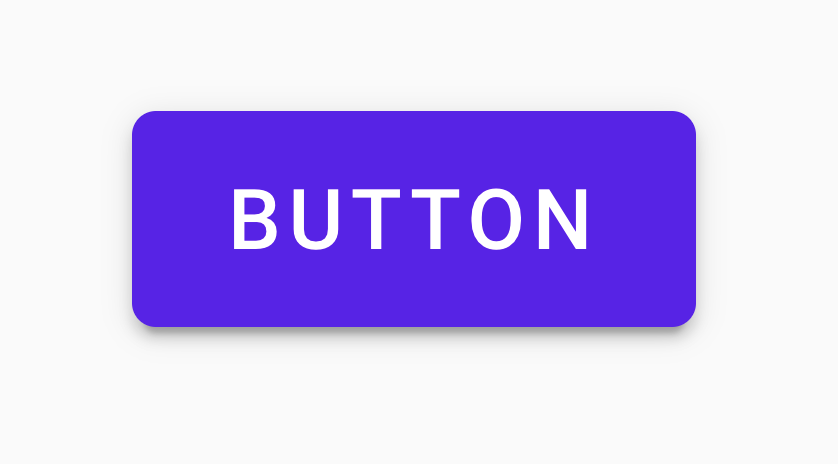
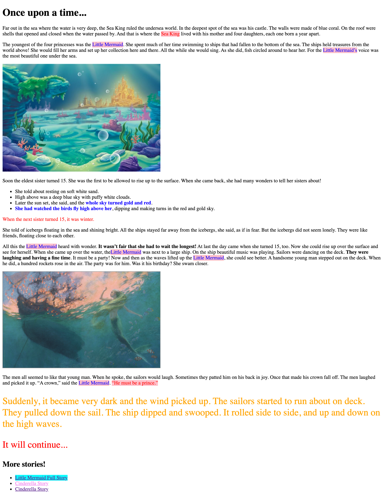

# fed-homework-css-1
Homework for the lesson of the 25.03.2021 - Introduction to CSS

# Part 1
- Create a button as shown in the image
- You can use external or internal CSS

CSS-Properties, that might be helpful for this are
[box-shadow](https://developer.mozilla.org/en-US/docs/Web/CSS/box-shadow), 
[border-radius](https://developer.mozilla.org/en-US/docs/Web/CSS/border-radius)
and [padding](https://developer.mozilla.org/en-US/docs/Web/CSS/padding)

#Part 2

The idea of this task is to practice selectors in CSS. You should not modify the classes or the elements in the body of the html.

- Use the html provided in selectors/selectors.html
- Add an external css file to this html
- In your css file add the neccessary code to acomplish the following
    1. Make the text with the class special RED
    2. Set the background of all the spans to PINK and the color BLUE
    3. Make the last paragraph element have a big font size and ORANGE
    4. Set the hover and focus states for all the links to have background CYAN
    5. Make the element with id "continue" to have a big font size
    6. Make all strong elements inside the list to have color BLUE
    7. Make the second link element to have background color VIOLET

It should look like this:

